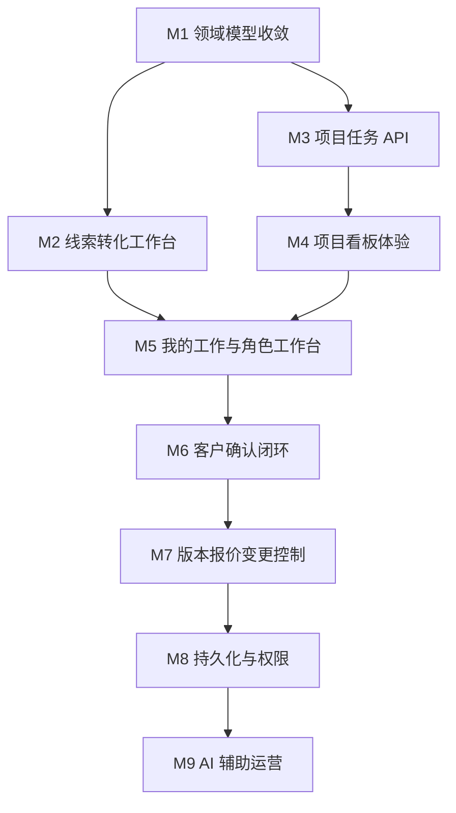

# 子需求拆解：家装运营工作区

本文档基于 [docs/prd.md](./prd.md) 和 [docs/roadmap.md](./roadmap.md)，把产品需求拆成可落地、可验收、可分批开发的子需求。

拆解原则：

- 每个子需求都应该能独立开发、评审和验收。
- 优先服务两条 V1 主线：`Lead + Sales Pipeline` 和 `ProjectTask + Space + WorkflowPhase + Assignee + Board + My Work`。
- V1 保持轻量，不引入完整 CRM、复杂流程引擎、任务评论、任务依赖和 AI 自动写入。
- 子需求默认先基于内存 demo 数据和共享类型实现，持久化放到 M8。

## 总览

## 优先级定义

- `P0`：V1 必须完成，否则无法验证核心业务闭环。
- `P1`：V1 建议完成，能明显提升演示完整度或使用价值。
- `P2`：后续增强，不阻塞 V1 验证。

## M1：领域模型收敛

目标：稳定共享契约，让线索、用户、阶段、任务和关联实体在前后端使用同一套字段。

| ID | 子需求 | 优先级 | 依赖 | 交付物 | 验收标准 |
| --- | --- | --- | --- | --- | --- |
| M1-01 | 升级 `Lead` 共享类型 | P0 | 无 | 在 `packages/shared` 中补充 `source`、`stage`、`intentLevel`、`ownerId`、`nextFollowUpAt`、`lastContactedAt`、`lastContactSummary`、`lostReason`、`projectId` | 前端和 API 可以引用同一套 `Lead` 字段；现有线索数据类型检查通过 |
| M1-02 | 新增 `User` 共享类型 | P0 | 无 | 定义用户 `id`、`name`、`role`、`status`、`avatarInitials` 等基础字段 | Demo 数据中至少包含销售、设计师、深化设计、项目经理、管理员 |
| M1-03 | 新增 `WorkflowPhase` 类型 | P0 | 无 | 定义阶段 `id`、`name`、`order`、`category`、`description` | Demo 阶段覆盖需求确认、平面方案、SU 模型、效果图、施工图、报价、交底、施工、验收 |
| M1-04 | 新增 `ProjectTask` 类型 | P0 | M1-02、M1-03 | 定义任务 `projectId`、`spaceId`、`phaseId`、`assigneeId`、`ownerRole`、`status`、`priority`、`dueDate`、`blockedReason`、`linkedEntities` | 一个任务能表达负责人、空间、阶段、状态和关联业务实体 |
| M1-05 | 新增 `TaskLinkedEntity` 类型 | P0 | M1-04 | 定义关联实体类型和实体 ID，覆盖需求单、设计版本、效果图、施工图、报价、变更、确认记录、巡检、附件 | 任务可以关联至少 3 类已有项目档案实体 |
| M1-06 | 扩展 demo seed 数据 | P0 | M1-01 到 M1-05 | 增加多来源线索、多阶段线索、多空间项目、多阶段任务、多负责人任务 | Demo 数据能同时演示线索转项目和项目任务执行 |
| M1-07 | 保持现有页面兼容 | P0 | M1-06 | 调整旧字段映射或兼容读取逻辑 | 首页、角色工作台、销售线索页、项目档案页、客户门户不因类型升级报错 |

### M1 开发备注

- V1 继续沿用现有 `Space`，不要新增并行的 `ProjectSpace`。
- `TaskAssignment`、`TaskComment`、`TaskDependency` 暂不实现，只保留未来扩展空间。
- 所有枚举命名应优先放在共享包中，避免前后端重复硬编码。

## M2：线索转化工作台

目标：让销售知道今天跟进谁、为什么跟进、下一步做什么；让管理者看到基础转化情况。

| ID | 子需求 | 优先级 | 依赖 | 交付物 | 验收标准 |
| --- | --- | --- | --- | --- | --- |
| M2-01 | 提供线索列表 API | P0 | M1-01、M1-06 | `GET /sales/leads` | 返回线索列表，包含阶段、来源、意向等级、负责人、下一次跟进时间、最近跟进摘要 |
| M2-02 | 提供线索摘要 API | P0 | M2-01 | `GET /sales/leads/summary` | 返回线索总数、新增数、各阶段数量、赢单数、流失数、基础转化率 |
| M2-03 | 升级 `/sales/leads` pipeline | P0 | M2-01 | 按 `new`、`contacted`、`measured`、`proposal`、`quoted`、`negotiating`、`won`、`lost` 展示线索 | 每个阶段能看到线索数量和对应卡片 |
| M2-04 | 今日需跟进视图 | P0 | M2-01 | 根据 `nextFollowUpAt` 聚合今日及逾期跟进线索 | 销售能一眼看到今天必须处理的线索 |
| M2-05 | 高意向线索视图 | P1 | M2-01 | 根据 `intentLevel` 展示高意向客户 | 高意向线索卡展示预算、来源、下一步动作 |
| M2-06 | 长期未跟进提醒 | P1 | M2-01 | 根据 `lastContactedAt` 标记长期未跟进线索 | 超过约定天数未跟进的线索有明显提示 |
| M2-07 | 线索关联项目入口 | P1 | M1-06、M2-01 | 在线索卡展示已关联 `projectId`，并能跳转项目档案 | 至少一个 demo 线索可以跳转到正式项目档案 |
| M2-08 | 线索转化指标组件 | P1 | M2-02 | 在销售页或首页展示基础转化指标 | 管理者能看到基础转化率和阶段分布 |

### M2 开发备注

- V1 只做读取和演示型阶段表达，`PATCH /sales/leads/:id/stage` 可以放在 M8 前后按需要补。
- 不做批量导入、广告投放归因、短信/微信触达和营销自动化。

## M3：项目任务 API

目标：形成统一任务数据层，让项目看板、我的工作页和角色工作台都消费同一套任务。

| ID | 子需求 | 优先级 | 依赖 | 交付物 | 验收标准 |
| --- | --- | --- | --- | --- | --- |
| M3-01 | 项目任务列表 API | P0 | M1-04、M1-06 | `GET /projects/:id/tasks` | 返回指定项目全部任务，包含空间、阶段、负责人、状态、优先级、截止日期 |
| M3-02 | 项目任务看板聚合 API | P0 | M3-01 | `GET /projects/:id/task-board` | 返回按空间和阶段分组的任务，以及任务统计摘要 |
| M3-03 | 我的任务 API | P0 | M1-02、M3-01 | `GET /tasks/my?assigneeId=...` | 返回指定负责人跨项目任务 |
| M3-04 | 任务状态更新 API | P1 | M3-01 | `PATCH /tasks/:id/status` | 可以把任务更新为 `todo`、`in_progress`、`blocked`、`waiting_client`、`done` 等状态 |
| M3-05 | 任务负责人更新 API | P1 | M1-02、M3-01 | `PATCH /tasks/:id/assignee` | 可以把任务负责人更新为 demo 用户 |
| M3-06 | 任务统计摘要 | P0 | M3-02 | 聚合 `totalTaskCount`、`blockedTaskCount`、`waitingClientCount`、`overdueTaskCount`、`blockedSpaceCount` | 项目看板顶部可以直接使用统计结果 |
| M3-07 | 关联实体摘要生成 | P1 | M1-05、M3-01 | 为任务返回关联实体的短标题或业务编号 | 任务卡可以展示“基于施工图 CD1”或“等待报价 quote-1 确认” |

### M3 开发备注

- V1 可以基于内存仓储实现读取和少量状态更新。
- 不实现 `POST /tasks`、任务评论、任务依赖和任务删除。

## M4：项目看板体验

目标：让项目团队快速判断每个空间处于哪个阶段、谁负责、被什么阻塞。

| ID | 子需求 | 优先级 | 依赖 | 交付物 | 验收标准 |
| --- | --- | --- | --- | --- | --- |
| M4-01 | 新增项目看板路由 | P0 | M3-02 | `/projects/[id]/board` | 可以从 URL 打开指定项目看板 |
| M4-02 | 空间分组布局 | P0 | M3-02 | 按 `Space` 分组展示任务 | 客餐厨、主卧、卫生间等空间可独立显示 |
| M4-03 | 阶段区块展示 | P0 | M3-02 | 在空间内按 `WorkflowPhase` 展示任务 | 同一项目不同空间可以处于不同阶段 |
| M4-04 | 任务卡片 | P0 | M3-01、M3-07 | 展示标题、状态、优先级、负责人、截止日期、关联实体摘要、阻塞原因 | 用户能从卡片判断下一步动作 |
| M4-05 | 看板摘要栏 | P0 | M3-06 | 展示总任务、阻塞、待客户确认、逾期、阻塞空间数量 | 用户能快速判断项目风险 |
| M4-06 | 项目档案入口互通 | P0 | M4-01 | 项目档案页增加看板入口，看板页返回项目档案 | 两个页面能互相跳转 |
| M4-07 | 移动端可读布局 | P1 | M4-02 到 M4-05 | 390px 宽度下可阅读和操作 | 空间分组、任务标题、状态、负责人不重叠 |

### M4 开发备注

- 设计必须遵循 `DESIGN.md`，保持温暖、低噪音、文档化。
- 看板是执行视图，不替代项目档案，不要把全部档案详情塞进卡片。

## M5：我的工作与角色工作台

目标：把“角色待办”推进到“具体负责人待办”，同时保留角色上下文。

| ID | 子需求 | 优先级 | 依赖 | 交付物 | 验收标准 |
| --- | --- | --- | --- | --- | --- |
| M5-01 | 新增个人任务页 | P0 | M3-03 | `/my-work` 或 `/tasks` | 可以按负责人查看跨项目任务 |
| M5-02 | 个人任务筛选 | P1 | M5-01 | 支持按项目、状态、优先级、截止日期、空间、阶段筛选 | 任务量较多时仍可快速定位 |
| M5-03 | 角色工作台任务聚合 | P0 | M3-01、M3-03 | 角色页从 `ProjectTask` 聚合指标和待办 | 销售、设计师、项目经理工作台不再只依赖旧 `WorkItem` |
| M5-04 | 销售工作台升级 | P0 | M2-01、M3-03 | 展示今日需跟进线索、高意向机会、待客户确认事项 | 销售不打开项目也能看到优先事项 |
| M5-05 | 设计工作台升级 | P1 | M3-03 | 展示设计输出、客户反馈、设计变更相关任务 | 设计师可以看到分配给自己的设计任务 |
| M5-06 | 项目经理工作台升级 | P1 | M3-03 | 展示施工节点、巡检问题、阻塞风险 | 项目经理可以看到跨项目阻塞任务 |

### M5 开发备注

- V1 没有真实登录时，可以使用 `assigneeId` 查询参数或 demo 用户切换器模拟当前用户。
- 角色维度用于工作台聚合，负责人维度用于行动归属。

## M6：客户确认闭环

目标：让客户确认成为可见、可追踪的阻塞因素。

| ID | 子需求 | 优先级 | 依赖 | 交付物 | 验收标准 |
| --- | --- | --- | --- | --- | --- |
| M6-01 | 任务关联确认记录 | P0 | M1-05、M3-01 | `ProjectTask.linkedEntities` 支持 `ConfirmationRecord` | 任务可以指向确认记录 |
| M6-02 | `waiting_client` 状态展示 | P0 | M3-01 | 看板和我的工作页识别 `waiting_client` | 待客户确认任务被计入风险或阻塞摘要 |
| M6-03 | 客户门户待确认列表 | P0 | M6-01 | 客户门户展示与客户项目相关的待确认事项 | 客户只看到自己项目下需要确认的内容 |
| M6-04 | 内部确认阻塞视图 | P1 | M6-02 | 销售和项目经理工作台展示确认阻塞任务 | 能看到谁负责跟进、已等待多久 |
| M6-05 | 驳回状态表达 | P2 | M6-03 | 客户驳回后在内部视图显示需要返工或补充说明 | V1 不自动生成返工任务 |

### M6 开发备注

- V1 不做复杂自动状态机。确认记录与任务状态可以先通过 demo 数据和手动状态更新表达。
- 客户确认不要自动推进设计、报价或施工状态。

## M7：版本、报价与变更控制

目标：减少因版本、报价和变更关系不清导致的返工。

| ID | 子需求 | 优先级 | 依赖 | 交付物 | 验收标准 |
| --- | --- | --- | --- | --- | --- |
| M7-01 | 设计版本关联展示 | P1 | M1-05、M4-04 | 任务卡展示关联 `DesignVersion` 或 `RenderingVersion` | 设计师能看到当前修改依据 |
| M7-02 | 施工图版本关联展示 | P1 | M1-05、M4-04 | 任务卡展示关联 `ConstructionDrawingVersion` | 项目经理能判断施工任务基于哪个图纸版本 |
| M7-03 | 报价关联展示 | P1 | M1-05、M4-04 | 任务卡展示关联 `Quotation` | 销售和设计师能看到报价是否影响当前任务 |
| M7-04 | 变更单关联展示 | P1 | M1-05、M4-04 | 任务卡展示关联 `ChangeOrder` | 现场问题和设计变更可以被追溯 |
| M7-05 | 未确认/已归档风险提示 | P2 | M7-01 到 M7-04 | 当关联版本未确认或已归档时显示提示 | 用户能识别版本依据风险 |
| M7-06 | 后续任务关联入口 | P2 | M3-01 | 报价变化或设计变更可以关联后续任务 | 不要求 V1 自动创建任务 |

## M8：持久化与权限

目标：从 demo 数据推进到真实多用户应用。

| ID | 子需求 | 优先级 | 依赖 | 交付物 | 验收标准 |
| --- | --- | --- | --- | --- | --- |
| M8-01 | 扩展 Prisma schema | P1 | M1 类型稳定 | Prisma schema 增加 `Lead`、`User`、`ProjectTask`、`WorkflowPhase`、`TaskLinkedEntity` | schema 能覆盖 V1 核心对象 |
| M8-02 | PostgreSQL seed | P1 | M8-01、M1-06 | 将 demo seed 写入数据库 | 本地数据库可初始化演示数据 |
| M8-03 | 任务读取迁移 | P1 | M8-01、M3-01 | 任务列表和看板从数据库读取 | 重启服务后数据仍存在 |
| M8-04 | 线索读取迁移 | P1 | M8-01、M2-01 | 线索列表和摘要从数据库读取 | 数据库线索能驱动销售页 |
| M8-05 | 基础认证 | P2 | M8-01 | 当前用户身份可被 API 识别 | `/tasks/my` 可以基于登录用户返回任务 |
| M8-06 | 轻量权限 | P2 | M8-05 | 销售、设计师、深化设计、项目经理、管理员、客户有基础访问边界 | 客户不能访问内部项目任务数据 |

## M9：AI 辅助运营

目标：只在能减少重复协同成本的地方使用 AI，并保证用户确认后才写入业务数据。

| ID | 子需求 | 优先级 | 依赖 | 交付物 | 验收标准 |
| --- | --- | --- | --- | --- | --- |
| M9-01 | 需求单生成任务草稿 | P2 | M3-01 | AI 根据 `RequirementSheet` 输出结构化任务草稿 | 输出不直接写入任务，用户可审阅 |
| M9-02 | 阶段检查清单建议 | P2 | M1-03 | AI 根据空间类型和阶段输出检查清单 | 输出结构化 checklist |
| M9-03 | 阻塞摘要生成 | P2 | M3-06、M6-02 | AI 汇总阻塞任务和待客户确认事项 | 摘要能说明阻塞点、负责人和建议下一步 |
| M9-04 | 巡检行动项提取 | P2 | 现有巡检记录 | AI 从巡检记录提取后续行动项草稿 | 行动项必须由用户确认后才能变成任务 |
| M9-05 | 客户友好确认摘要 | P2 | M6-03 | AI 生成客户可读的确认说明草稿 | 用户能区分 AI 建议和正式确认内容 |

## V1 推荐开发批次

### Batch 1：共享模型和 demo 数据

包含：

- M1-01 到 M1-07

完成后应能验证：

- 类型稳定。
- Demo 数据具备线索转项目和项目任务两条链路。
- 现有页面不破坏。

### Batch 2：线索读取和销售工作台

包含：

- M2-01 到 M2-08

完成后应能验证：

- 销售能看到 pipeline、今日跟进、高意向、长期未跟进。
- 管理者能看到基础转化率。

### Batch 3：任务 API 和项目看板

包含：

- M3-01 到 M3-07
- M4-01 到 M4-07

完成后应能验证：

- 项目按空间和阶段展示任务。
- 任务卡能说明负责人、下一步、阻塞原因和关联实体。

### Batch 4：我的工作和角色工作台

包含：

- M5-01 到 M5-06

完成后应能验证：

- 个人负责人可以看到自己的跨项目任务。
- 角色工作台不再只依赖角色型 `WorkItem`。

### Batch 5：客户确认和业务关联增强

包含：

- M6-01 到 M6-05
- M7-01 到 M7-04

完成后应能验证：

- 客户确认可以作为阻塞因素出现在内部视图。
- 设计版本、施工图、报价和变更能被任务引用。

## 不纳入 V1 的需求

- 完整 CRM 自动化。
- 线索批量导入。
- 营销活动、群发触达、广告投放归因。
- 复杂销售漏斗配置。
- 任务评论。
- 任务依赖。
- 多负责人和负责人变更历史。
- 空间流程模板生成。
- 公司级自定义流程配置。
- 真实文件上传和对象存储。
- 多租户商业化能力。
- AI 自动推进任务状态。

## 子需求验收口径

每个子需求完成时至少满足：

- 有明确页面、API、共享类型或 demo 数据交付物。
- 有可演示路径或可调用接口。
- 不破坏当前已有首页、销售线索页、角色工作台、项目档案页和客户门户。
- 与 `DESIGN.md` 的视觉方向一致。
- 若涉及状态变化，必须能说明状态来源和更新边界。
