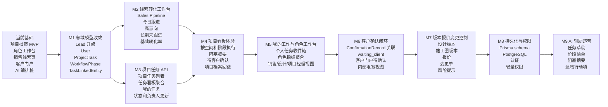
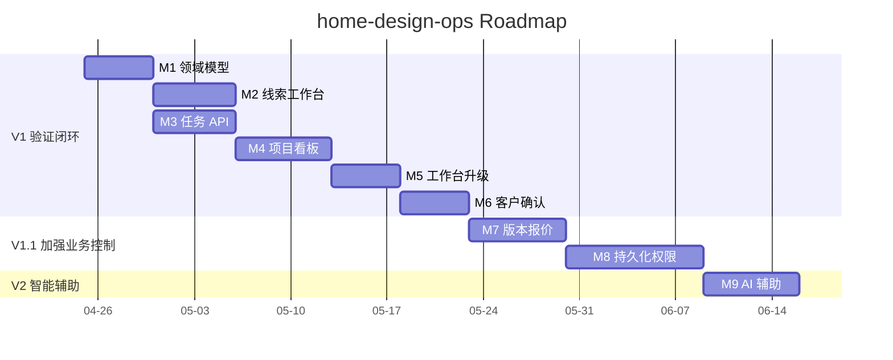

# Roadmap：家装运营工作区演进路线

这份路线图用于把 `home-design-ops` 从当前“项目档案 MVP”推进为一个面向家装设计公司的运营工作区。路线图以 [docs/prd.md](./prd.md) 为准，优先验证两条最小业务闭环：

- `Lead + Sales Pipeline`：帮助公司跟踪潜在客户，减少漏跟，提升线索到项目的转化率。
- `ProjectTask + Space + WorkflowPhase + Assignee + Board + My Work`：让团队围绕项目、空间、阶段、负责人和客户确认推进执行。

产品不应该变成通用 CRM 或通用项目管理工具。它的核心优势应该来自家装业务上下文：线索来源、量房/报价/签约推进、项目空间、设计阶段、版本资产、客户确认、报价联动、施工交底和责任人闭环。

## 产品方向

构建一个安静、清晰、可执行的运营工作区，让家装团队可以快速回答这些问题：

- 当前有哪些潜在客户？
- 哪些线索今天必须跟进？
- 哪些高意向客户正在接近签约？
- 哪些线索已经长期未跟进或可能流失？
- 当前有哪些活跃项目？
- 哪些空间或房间被阻塞？
- 每个空间处在哪个阶段？
- 下一步动作由谁负责？
- 哪些客户确认、图纸、报价或现场问题正在影响推进？

交互模型可以参考 Linear 和 Notion，但领域模型必须保持家装行业特征。

## 路线图总览

## 当前基础

已经实现：

- 基于 Next.js 的前端应用，包含首页工作区、角色工作台、销售线索页、项目档案页和客户门户。
- 基于 NestJS 的 REST API，目前使用内存 demo 数据。
- 共享 TypeScript 领域模型。
- 项目档案数据已经覆盖客户、线索、需求单、空间、设计版本、效果图、施工图、报价、变更、里程碑、巡检、确认记录和附件。
- 已有面向销售、设计师、项目经理的基础角色任务流。
- 已有 AI 编排桩实现，用于需求提取、布局建议、效果图建议、图纸校核和巡检摘要。

主要缺口：

- 线索还没有形成围绕来源、阶段、意向、负责人和下一次跟进时间的转化工作台。
- 当前工作仍然围绕角色工作台和项目档案组织，还没有形成真正的项目任务模型。
- 缺少空间阶段、个人负责人、任务状态生命周期和任务关联实体的统一表达。
- 客户确认、报价、设计版本和施工图版本还没有稳定地映射到执行任务。

## 北极星对象模型

V1 优先稳定这些对象：

- `Lead`：潜在客户和销售机会，记录来源、阶段、意向等级、负责人、下一次跟进时间和转项目关系。
- `Customer`：客户主体，承载联系人和客户画像。
- `Project`：一个正式家装项目，由高意向或赢单线索转化而来。
- `Space`：项目内空间，例如客厅、厨房、卧室、卫生间、阳台、全屋收纳。V1 沿用现有 `Space`，不新增并行的 `ProjectSpace`。
- `WorkflowPhase`：可复用的阶段，例如需求确认、平面方案、SU 模型、效果图、施工图、报价、交底、施工、验收。
- `ProjectTask`：执行单元，属于项目，可绑定空间、阶段、负责人和关联实体。
- `User`：真实人员，不能只停留在角色层面。
- `TaskLinkedEntity`：任务与需求单、设计版本、效果图、施工图、报价、变更、确认记录、巡检或附件之间的关联。

后续再引入：

- `TaskComment`：讨论、交接和处理记录。
- `TaskDependency`：任务之间的阻塞和依赖关系。
- `TaskAssignment`：多人负责人或负责人变更历史。
- 独立的跟进记录时间线，用于替代 V1 的 `lastContactSummary`。

## 阶段依赖

图中的阶段名称为短标签，完整阶段名称以正文 `M1` 到 `M9` 小节为准。日期只表达建议节奏，不作为固定排期承诺。真实执行时以可验证交付物为准。

## M1：领域模型收敛

目标：先稳定共享契约，避免前后端各自发明线索、任务和阶段字段。

范围：

- 升级 `Lead` 类型，补充：
  - `source`
  - `stage`
  - `intentLevel`
  - `ownerId`
  - `nextFollowUpAt`
  - `lastContactedAt`
  - `lastContactSummary`
  - `lostReason`
  - `projectId`
- 新增 `User`、`WorkflowPhase`、`ProjectTask`、`TaskLinkedEntity`。
- V1 继续沿用现有 `Space`，不新增并行的 `ProjectSpace`。
- 扩展 demo seed 数据，至少覆盖：
  - 多个来源的潜在客户
  - 高意向、长期未跟进、已赢单、已流失线索
  - 一个由线索关联到正式项目的 demo
  - 多空间、多阶段、多负责人任务

验收标准：

- `packages/shared` 中有稳定类型，API 和 Web 共用同一套字段。
- Demo 数据能展示线索转项目和项目任务执行两条链路。
- 不破坏现有首页、角色工作台、项目档案和客户门户。

## M2：线索转化工作台

目标：让销售和管理者能看见潜在客户是否被及时跟进，以及线索是否在向签约推进。

范围：

- 升级 `/sales/leads`。
- 按线索阶段展示 pipeline：
  - `new`
  - `contacted`
  - `measured`
  - `proposal`
  - `quoted`
  - `negotiating`
  - `won`
  - `lost`
- 展示今日需跟进、高意向、长期未跟进和即将流失线索。
- 展示基础转化指标：
  - 线索总数
  - 新增线索数
  - 各阶段线索数量
  - 赢单数
  - 流失数
  - 基础转化率
- 提供读取接口：
  - `GET /sales/leads`
  - `GET /sales/leads/summary`
- 保留 V1 边界：不做营销自动化、群发触达、广告投放归因和复杂漏斗配置。

验收标准：

- 销售打开 `/sales/leads` 可以知道今天跟进谁、为什么跟进、下一步做什么。
- 管理者可以看到线索来源、阶段分布和基础转化质量。
- 至少一个 demo 线索可以关联到正式项目档案。

## M3：项目任务 API

目标：把当前角色型 `WorkItem` 升级为项目任务数据结构，让看板和我的工作页复用同一套任务数据。

范围：

- 增加项目任务列表和聚合接口：
  - `GET /projects/:id/tasks`
  - `GET /projects/:id/task-board`
  - `GET /tasks/my?assigneeId=...`
- 增加少量状态更新接口：
  - `PATCH /tasks/:id/status`
  - `PATCH /tasks/:id/assignee`
- 任务支持：
  - `projectId`
  - `spaceId`
  - `phaseId`
  - `assigneeId`
  - `ownerRole`
  - `status`
  - `priority`
  - `dueDate`
  - `blockedReason`
  - `linkedEntities`
- 状态至少支持：
  - `backlog`
  - `todo`
  - `in_progress`
  - `blocked`
  - `waiting_client`
  - `waiting_internal`
  - `done`
  - `canceled`

验收标准：

- 一个任务可以表达“谁在什么空间、什么阶段、基于什么资料、下一步做什么”。
- 一个用户可以看到自己跨项目的任务。
- 项目看板和我的工作页可以复用同一套 API 数据。

## M4：项目看板体验

目标：创建第一版项目执行看板，让团队快速判断项目阻塞点。

范围：

- 新增 `/projects/[id]/board`。
- 看板按 `Space` 分组，并在空间内按阶段展示任务。
- 任务卡展示：
  - 标题
  - 状态
  - 优先级
  - 负责人
  - 截止日期
  - 关联实体摘要
  - `blockedReason`
- 看板顶部展示：
  - `totalTaskCount`
  - `blockedTaskCount`
  - `waitingClientCount`
  - `overdueTaskCount`
  - `blockedSpaceCount`
- 从项目档案页增加进入项目看板的入口。
- 视觉风格遵循 `DESIGN.md`：温暖、文档化、低噪音、接近 Notion 的运营工具感。

验收标准：

- 用户能看到哪个空间被阻塞以及阻塞原因。
- 移动端宽度 390px 下，空间分组、任务标题、状态和负责人信息不重叠。
- 看板不替代项目档案，而是作为执行视图补充项目档案。

## M5：我的工作与角色工作台

目标：让责任归属从角色层面推进到具体人员层面。

范围：

- 新增 `/my-work` 或 `/tasks`。
- 按截止日期、状态、项目、空间和阶段展示个人任务。
- 将角色工作台升级为真实任务聚合，而不是只依赖角色型 `WorkItem`。
- 销售工作台突出：
  - 今日需跟进线索
  - 高意向机会
  - 待客户确认事项
- 设计工作台突出：
  - 设计输出任务
  - 客户反馈
  - 设计变更
- 项目经理工作台突出：
  - 施工节点
  - 巡检问题
  - 阻塞风险

验收标准：

- 设计师可以只看到分配给自己的设计任务。
- 项目经理可以看到所有活跃项目中的阻塞任务。
- 销售不需要逐个项目查找，就能看到线索跟进和客户确认相关事项。

## M6：客户确认闭环

目标：把客户确认作为一等阻塞因素，但 V1 不做复杂自动状态机。

范围：

- 任务可以关联 `ConfirmationRecord`。
- 任务可以进入或展示为 `waiting_client`。
- 客户门户展示待确认事项、确认对象、说明和备注入口。
- 内部视图展示确认阻塞信息：
  - 哪个任务被阻塞
  - 哪个资产正在等待确认
  - 谁需要跟进
  - 已等待多久
- 驳回后的返工任务生成放到后续阶段；V1 可以通过更新原任务状态或备注表达返工需要。

验收标准：

- 销售可以看到所有 `status = waiting_client` 的任务。
- 客户门户只展示与客户项目相关、且关联 `ConfirmationRecord` 的待确认事项。
- 内部看板可以把待客户确认计入阻塞或风险摘要。

## M7：版本、报价与变更控制

目标：减少由于设计版本、报价版本和变更记录不清晰导致的返工。

范围：

- 任务可以关联设计版本、效果图版本、施工图版本、报价和变更单。
- 任务卡片展示当前依据的版本，例如“基于施工图 CD1”或“等待报价 quote-1 确认”。
- 当任务依赖未确认或已归档版本时给出提醒。
- 报价差异或设计变更发生时，可以创建或关联后续任务。
- 关键阶段流转需要保留决策历史。

验收标准：

- 项目经理可以判断施工任务基于哪个施工图版本。
- 设计师可以看到哪个客户确认阻塞了设计变更。
- 报价更新可以创建或关联后续跟进任务。

## M8：持久化与权限

目标：从 demo 数据推进到真实多用户应用。

范围：

- 扩展 Prisma schema，加入 `Lead`、`User`、`ProjectTask`、`WorkflowPhase` 和 `TaskLinkedEntity`。
- 将核心读取和少量写操作从内存仓储迁移到 PostgreSQL。
- 增加认证，并支持基于当前登录用户的视图。
- 增加轻量权限：
  - 管理员可以查看和管理全部数据。
  - 销售可以管理线索、客户跟进和客户确认。
  - 设计师可以管理设计相关任务和设计资产。
  - 深化设计可以管理施工图、柜体、点位和交底前深化任务。
  - 项目经理可以管理施工节点、巡检、交底、现场问题和验收。
  - 客户只能访问客户门户中与自己项目相关的确认事项。
- 增加 migration 和 seed 脚本。

验收标准：

- demo 数据可以写入 PostgreSQL。
- 创建和更新任务后，服务重启仍然保留数据。
- 个人任务收件箱来自真实登录身份。

## M9：AI 辅助运营

目标：只在能减少重复协同成本的地方使用 AI，且不让 AI 静默改变业务状态。

范围：

- 从需求单生成任务草稿。
- 根据空间类型建议阶段检查清单。
- 汇总阻塞任务，生成每日运营摘要。
- 检查施工图交底任务是否缺少必要确认。
- 生成客户友好的确认摘要。
- 从会议纪要或巡检记录中提取行动项。

验收标准：

- AI 输出必须结构化、可审阅。
- AI 不允许静默修改项目状态。
- AI 建议任务必须经过用户确认后才能加入项目。

## 范围边界

V1 不做：

- 完整 CRM 自动化。
- 营销活动、群发触达和广告投放归因。
- 复杂销售漏斗配置。
- 复杂审批流引擎。
- 任务评论、任务依赖和负责人变更历史。
- 公司级自定义流程配置。
- 真实文件上传和对象存储实现。
- 多租户商业化能力。

## 近期建议实施顺序

1. 收敛 `Lead`、`User`、`ProjectTask`、`WorkflowPhase` 和 `TaskLinkedEntity` 共享类型。
2. 扩展 demo seed 数据，覆盖线索转化和项目任务两条闭环。
3. 实现 `GET /sales/leads` 和 `GET /sales/leads/summary`。
4. 实现 `GET /projects/:id/task-board`、`GET /projects/:id/tasks` 和 `GET /tasks/my`。
5. 升级 `/sales/leads`，先做可读的 pipeline 和跟进优先级。
6. 新增 `/projects/[id]/board`，再升级 `/my-work` 和角色工作台。
